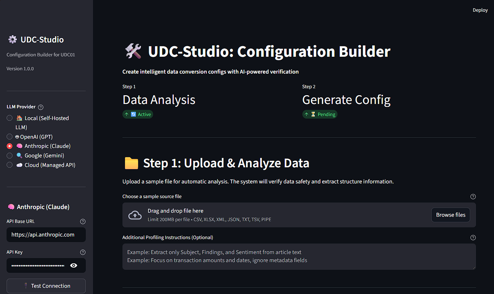
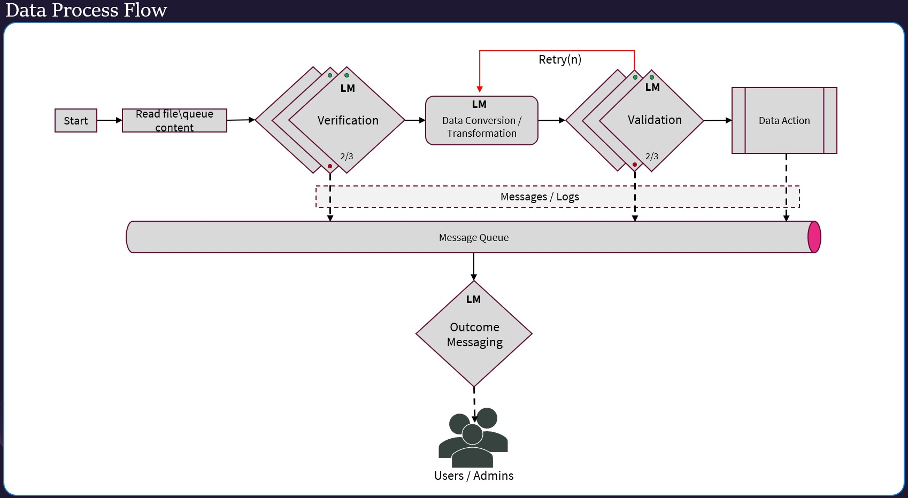

# Universal Data Converter (UDC01)
<!-- markdownlint-disable first-line-h1 -->
<!-- markdownlint-disable html -->
<div>
  <h2>AI-Powered Data Transformation That Actually Works</h2>
</div>
<div align="center">
  
</div>

## Table of Contents
- [Introduction](#introduction)
- [Getting Started](#getting-started)
  - [Command Line Interface (CLI)](#️-command-line-interface-cli)
  - [UDC-Studio (Configuration Builder)](#-udc-studio-configuration-builder)
  - [UDC-Cookbook](#-udc-cookbook)
- [Key Features](#key-features)
- [Framework Architecture](#framework-architecture)
  - [Data Process Flow](#data-process-flow)
- [Technical Requirements](#technical-requirements)
- [Installation](#installation)
- [Usage](#usage)
  - [Command Line Options](#command-line-options)
  - [Example Commands](#example-commands)
- [Sample Conversions](#sample-conversions)
- [Validation Mechanism & Evolution](#validation-mechanism--evolution)
- [Cloud Provider Configuration](#cloud-provider-configuration)
  - [Setting Up API Keys](#setting-up-api-keys)
  - [Provider Configuration](#provider-configuration)
  - [Per-Agent Provider Selection](#per-agent-provider-selection)
  - [Performance Optimization for Cloud APIs](#performance-optimization-for-cloud-apis)
  - [Detailed Logging](#detailed-logging)
- [Configuration Files](#configuration-files)
- [Configuration Hierarchy Guide](CONFIGURATION.md)
- [License](#license)
- [Contact & Community](#contact--community)


## Introduction

The **Universal Data Converter (UDC01)** is an AI-driven data transformation framework built around a single practical truth: real-world data arrives in every shape, format, and level of consistency imaginable, and downstream systems need it clean and standardized every time.

UDC01 handles **structured, semi-structured, and unstructured** inputs - Excel, CSV, JSON, XML, HTML, TXT, and PDF - and transforms them into consistent, enterprise-ready output formats.  The engine behind this reliability is a **2/3 majority voting system**: three independent LLM agents process and validate each transformation, and at least two must agree before the result is accepted.  This approach turns AI's inherent variability into a statistical advantage, achieving accuracy rates that no single model can match on its own.

For people and organizations dealing with diverse, inconsistent data sources that need to feed downstream systems reliably, UDC01 was built for exactly that problem.

---

## Getting Started

UDC01 runs from the command line. If you're new and haven't written a conversion YAML yet, UDC-Studio can build one for you - then you can run it in UDC01.

### 🖥️ **Command Line Interface (CLI)**
This is UDC01. The CLI is how you run conversions and transformations - in automation, in scripts, in production pipelines.  Pass it a file and a conversion configuration, and it handles everything from verification through validation to output.  See the [Usage](#usage) section below for the full option set.

```bash
python udc01.py --file "samples/sources/sales_invoice.csv"
```

### 🎨 **UDC-Studio (Configuration Builder)**
UDC-Studio is a companion tool, not a runner.  It's a Streamlit-based web app that analyzes your data and generates the YAML conversion configuration that UDC01 needs.  Once you download the YAML from Studio, you can run it with `udc01.py` as usual. UDC-Studio is especially useful for:
- First-time users who need a YAML starting point without writing one by hand
- Quickly prototyping configurations for new data formats
- Understanding your data's structure before writing conversion rules
- AI-assisted configuration generation with multi-agent validation

<p align="center">
  
  <!---->
</p>

**Quick Start with UDC-Studio:**
```bash
pip install -r requirements_studio.txt
python udc_studio.py
```

See the [**UDC-Studio Guide**](UDC-STUDIO.md) for complete instructions and walkthrough.

### 📖 **UDC-Cookbook**
The [**UDC-Cookbook**](https://github.com/IDXNow/UDC-Cookbook) is a community collection of ready-to-use YAML conversion configurations.  If you're working with a common format - EDI, ACH, XML product feeds, PDF invoices, HTML tables - there's likely already a recipe you can clone and adapt rather than starting from scratch.  The Cookbook covers conversion, extraction, enrichment, and code transform patterns.  Think of every recipe as a starting point.

---

## Key Features

UDC01 was designed to: accept anything, validate thoroughly, and run reliably without intervention.  Here's how we applied those principles:

- **Multiple Input Formats**: Supports Excel, CSV, JSON, XML, HTML, TXT, and PDF files
- **Flexible Output Formats**: Save results as text files or Excel workbooks (.xlsx)
- **Intelligent Data Processing**: Advanced LLM-based transformation pipeline for handling structured, semi-structured, and unstructured input data
- **Multi-Stage Validation**: Implements a 2/3 voting mechanism across multiple LLM agents to ensure transformation accuracy
- **Multi-Provider Support**: Works with local models, OpenAI (GPT), Anthropic (Claude), and Google (Gemini)
- **Parallel Execution**: Concurrent agent execution for faster processing with cloud APIs
- **Automated Workflow**: Complete pipeline from data intake to output generation with minimal human intervention
- **Early-Exit Consensus**: When the first two agents agree, the third is never called - saving time and API cost without sacrificing accuracy
- **Retry Mechanism**: Configurable retry attempts for failed conversions with exponential backoff
- **Agent Identification System**: Unique identifiers and human-readable names for each LLM agent in the process
- **Detailed Logging**: Optional comprehensive logging with error tracking and performance metrics

---

## Framework Architecture

### Data Process Flow

The transformation pipeline runs in four stages, each building on the last.  The design is intentional: by default, no data transformation or conversion is performed until the input has been verified, and no result is accepted until it has been independently validated.  Verification can be skipped for pipelines where source data quality is already guaranteed - see [Conversion Configuration (YAML)](#conversion-configuration-yaml).

1. **Input Processing**
   - File/queue content reading (Excel, CSV, JSON, XML, HTML, TXT, PDF)
   - PDF text extraction with table support
   - Initial data structure analysis
   - Format identification

2. **LLM Verification (2/3 Consensus)**
   - Field completeness verification
   - Structure validation
   - Data integrity checks

3. **Intelligent Transformation**
   - Format-specific processing
   - Data standardization
   - Quality assurance checks
   - Configurable retry mechanism for failed conversions

4. **Multi-Stage Validation**
   - Three independent LLM validations
   - Automatic retry mechanism
   - Comprehensive validation reporting

<p align="center">
  
  <!---->
</p>

---

## Technical Requirements

### Dependencies
These are the Python packages you need to run UDC01 with the included samples:

```
pandas
pyyaml
requests
openpyxl
pdfplumber
```

### LLM Requirements
UDC01 works with any combination of local and cloud-hosted models - you're not locked into a single provider.

**Self-Hosted & Custom Endpoints:**
- LM Studio (default: http://localhost:1234/) or Ollama (default: http://localhost:11434/)
- Any endpoint speaking the OpenAI chat-completions format - vLLM, llama.cpp, a LiteLLM proxy, Azure OpenAI, or a private GPU host
- Add an `auth_header` and an `api_keys` entry when the endpoint needs credentials; leave them off for localhost

Model IDs are sent exactly as configured, so copy them from `lms ls`, `ollama list`, or your host's model list - namespaces like `openai/gpt-oss-20b` and `meta-llama/Llama-3.3-70B-Instruct` are part of the name.

**Cloud Providers:**
- **OpenAI**: GPT-5, GPT-5-mini, GPT-5-nano, gpt-5.6-terra
- **Anthropic**: Claude 5 Sonnet, Claude 4.5 Haiku, Claude 5 Opus, Claude 5.1 Fable
- **Google**: Gemini 3.7 Flash, Gemini 3.5 Flash-Lite, Gemini 3.1 Pro

**Note**: Cloud providers require API keys set as environment variables. See [Cloud Provider Configuration](#cloud-provider-configuration) for details.

---

## Installation

1. Clone the repository:
   ```bash
   git clone https://github.com/IDXNow/UDC01.git
   cd UDC01
   ```

2. Install the required packages:
   ```bash
   pip install pandas pyyaml requests openpyxl
   ```
   or
   ```bash
   pip install -r requirements.txt
   ```

3. **For Self-Hosted Models**: Ensure your endpoint is reachable (LM Studio default: http://localhost:1234/, Ollama: http://localhost:11434/). Remote endpoints also need `auth_header` and an `api_keys` entry on the profile.

4. **For Cloud Providers**: Set up API keys as environment variables:
   ```powershell
   # Windows PowerShell
   $env:OPENAI_API_KEY="sk-proj-..."
   $env:ANTHROPIC_API_KEY="sk-ant-..."
   $env:GOOGLE_API_KEY="..."
   ```
   ```bash
   # Linux/Mac
   export OPENAI_API_KEY="sk-proj-..."
   export ANTHROPIC_API_KEY="sk-ant-..."
   export GOOGLE_API_KEY="..."
   ```

   See [Cloud Provider Configuration](#cloud-provider-configuration) for detailed setup instructions.

---

## Usage

UDC01 runs from the command line.  Point it at a file, specify a conversion configuration, and it handles the rest.

### Command Line Options

```bash
python udc01.py
  --config CONFIG_PATH           # Path to main configuration file (default: udc01/default_config.json)
  --conversion CONVERSION_PATH   # Path to conversion YAML (default: samples/conversions/sales_invoice_conv.yaml)
  --file FILE_PATH               # Specific file to load
  --folder FOLDER_PATH           # Folder to search for files
  --pattern FILE_PATTERN         # File search pattern (e.g., '*.csv')
  --output-folder OUTPUT_PATH    # Folder to save output files
  --parallel-agents              # Run validator agents in parallel (faster for cloud APIs)
  --include-prior-output-on-retry     # Feed the previous failed output back on retry
  --no-include-prior-output-on-retry  # ...or force that behavior off
```

If you omit `--config` or `--conversion`, UDC01 uses its built-in defaults. You can also copy and customize `udc01/default_config.json` as your own starting point.

**Performance Tip**: Enable `--parallel-agents` when working with cloud API providers (OpenAI, Anthropic, etc.)

### Example Commands

#### Converting a CSV file to pipe-delimited format (using defaults):

```bash
python udc01.py --file "samples/sources/sales_invoice.csv"
```

Or explicitly specify the conversion configuration:

```bash
python udc01.py --conversion "samples/conversions/sales_invoice_conv.yaml" \
                --file "samples/sources/sales_invoice.csv"
```

#### Converting an XML file to pipe-delimited format:

```bash
python udc01.py --conversion "samples/conversions/product_inventory_conv.yaml" \
                --file "samples/sources/product_inventory.xml"
```

#### Converting multiple files in a directory:

```bash
python udc01.py --conversion "samples/conversions/customer_order_conv.yaml" \
                --folder "samples/sources" \
                --pattern "*.xlsx"
```

#### Using parallel execution for faster processing (cloud APIs):

```bash
python udc01.py --file "samples/sources/sales_invoice.csv" \
                --parallel-agents
```

#### Using cloud providers with custom configuration:

```bash
# Set up your API keys first
set ANTHROPIC_API_KEY=sk-ant-...
set OPENAI_API_KEY=sk-proj-...

# Use the cloud example configuration
python udc01.py --config "samples/config/cloud_example_config.json" \
                --file "samples/sources/sales_invoice.csv" \
                --parallel-agents
```

This uses Claude for conversion and GPT/Gemini for validation, running validators in parallel for maximum speed.

---

## Sample Conversions

The repository includes several sample data files and corresponding conversion configurations - a good way to see the framework in action before building your own.  For a broader library of community-contributed patterns (EDI, ACH, PDF extraction, sentiment enrichment, SQL transforms, and more), see the [**UDC-Cookbook**](https://github.com/IDXNow/UDC-Cookbook).

### Sales Invoice (CSV to Pipe-delimited)
**Input**: A CSV file containing sales invoice data with multiple columns
**Configuration**: `samples/conversions/sales_invoice_conv.yaml`
**Output**: Pipe-delimited text file with standardized columns:
```
InvoiceID|CustomerID|CustomerName|InvoiceDate|DueDate|TotalAmount|PaymentStatus
INV-001|CUST-100|Acme Corporation|2023-01-15|2023-02-15|1250.75|Paid
```

### Product Inventory (XML to Pipe-delimited)
**Input**: XML structured product inventory data
**Configuration**: `samples/conversions/product_inventory_conv.yaml`
**Output**: Pipe-delimited text file with standardized columns:
```
SKU|ProductName|Brand|QuantityOnHand|Status|RetailPrice
PROD-100|Deluxe Widget|XYZ Manufacturing|150|In Stock|29.99
```

### Customer Orders (Excel to Pipe-delimited)
**Input**: Excel spreadsheet with customer order information
**Configuration**: `samples/conversions/customer_order_conv.yaml`
**Output**: Pipe-delimited text file with standardized columns:
```
OrderNumber|CustomerID|CustomerName|OrderDate|ProductSKU|ProductDescription|Quantity|OrderTotal|ShippingStatus
ORD-12345|CUST-100|Acme Corporation|2023-01-20|PROD-100|Deluxe Widget|10|299.90|Shipped
```

### PDF Invoice Processing (PDF to Pipe-delimited)
**Input**: PDF document with invoice data (text-based or containing tables)
**Configuration**: `samples/conversions/sales_invoice_conv.yaml`
**Output**: Pipe-delimited text file with extracted and standardized invoice data:
```
InvoiceID|CustomerID|CustomerName|InvoiceDate|DueDate|TotalAmount|PaymentStatus
INV-2024-001|CUST-500|Global Enterprises|2024-01-20|2024-02-20|3750.00|Pending
```

**Note**: PDF text extraction works best with text-based PDFs. Tables are automatically detected and extracted. For scanned documents, OCR preprocessing may be required (future enhancement).

### Excel Output
UDC01 can save conversion results as Excel workbooks (.xlsx) instead of text files, making it easy to open results directly in Excel or other spreadsheet applications.

**To enable Excel output:**

1. Edit `udc01/default_config.json`:
   ```json
   "file_save": {
     "folder": "output/",
     "file_extension": "xlsx"
   }
   ```

2. Run any conversion:
   ```bash
   python udc01.py --file "samples/sources/sales_invoice.csv"
   ```

3. Result: `output/sales_invoice-20240111-143022.xlsx` with formatted table

**Supported formats for Excel export:**
- Pipe-delimited data (most common UDC01 output)
- CSV format
- JSON arrays

**Features:**
- Automatic column width adjustment for readability
- Headers in first row
- Data preserved with proper formatting
- Graceful fallback to text for non-tabular outputs (SQL views, plain text)

**Note**: Non-tabular outputs (such as SQL CREATE VIEW statements) will automatically fall back to `.txt` format with a warning logged.

---

## Validation Mechanism & Evolution

### 2/3 Majority Consensus

Here's the design decision that makes UDC01 genuinely reliable rather than just usually reliable. Rather than trusting a single LLM's output, we run three independent agents and require at least two to agree before accepting the result. This applies at both ends of the pipeline: before conversion starts, and after it completes.

1. **Pre-Conversion Verification**:
   - Three independent LLM agents verify the input data's structure and content
   - At least two agents must approve for processing to continue
   - Early-exit optimization: If the first two agents agree, the third agent is not called
   - Can be disabled per-conversion with `verification: { enabled: false }` in the YAML config when source data quality is guaranteed

2. **Post-Conversion Validation**:
   - Three independent LLM agents validate the conversion output
   - At least two agents must approve the conversion
   - Early-exit optimization: If the first two agents agree, the third agent is not called

3. **Retry Logic**:
   - If validation fails, conversion is retried up to a configurable number of times
   - Each retry uses the same input data but may generate different outputs

### Multi-Agent Validation: Statistical Reliability

The accuracy gains from the 2/3 majority system are substantial. Even a model that's right 90% of the time individually produces a consensus system that's right 97.2% of the time - because errors from independent agents don't correlate.  At the quality levels you'd expect from modern frontier models, error rates drop by more than 95%.

| Agent Quality | Single Agent Accuracy | **UDC01 2/3 Majority Accuracy** | Error Reduction |
|---------------|----------------------|----------------------------|----------------|
| :robot:90% | 90.0% | **97.2%** | 72% |
| :robot:95% | 95.0% | **99.3%** | 86% |
| :robot:98% | 98.0% | **99.9%** | 95% |

This is the core tension the framework resolves: LLMs are inherently variable, but enterprise data systems need consistent, predictable outputs.  The 2/3 consensus mechanism is how we bridge that gap.

### From ETL Developer to Data Prompt Engineer

Data engineering has always evolved with its tooling - from hand-coded transformations to declarative ETL frameworks to orchestration platforms.  Data Prompt Engineering is the natural next step in the field.  

Rather than writing procedural code for each new data format, a Data Prompt Engineer crafts the instructions that guide LLMs through reliable transformations.  This emerging specialization involves:

- Crafting precise, robust prompts that guide LLMs in performing reliable data transformations
- Implementing validation gates and quality checks specifically designed for LLM-driven processes
- Creating reusable prompt templates that ensure consistent processing across diverse data formats
- Balancing deterministic validation with the flexibility of natural language processing

UDC01 provides the framework.  The YAML conversion configuration is where the engineering happens - writing transformation instructions that work consistently across the full range of input your data sources can throw at you.

---

## Cloud Provider Configuration

UDC01 supports multiple cloud-based LLM providers, and you can mix them freely - a different provider for each agent if that's what your cost/performance tradeoff calls for.  Each agent can use a different provider, model, and temperature independently.

### Setting Up API Keys

Cloud providers require API keys.  We recommend storing them as environment variables rather than in config files - this keeps credentials out of version control and lets you rotate keys without touching your configuration.

**Windows (PowerShell):**
```powershell
$env:OPENAI_API_KEY="sk-proj-..."
$env:ANTHROPIC_API_KEY="sk-ant-..."
$env:GOOGLE_API_KEY="..."
```

**Linux/Mac:**
```bash
export OPENAI_API_KEY="sk-proj-..."
export ANTHROPIC_API_KEY="sk-ant-..."
export GOOGLE_API_KEY="..."
```

The configuration file references these with `${OPENAI_API_KEY}` placeholders that are resolved at runtime.  Never commit API keys to version control.

### Provider Configuration

The `default_config.json` includes provider definitions for all supported services:

```json
{
  "default_provider": "local",
  "providers": {
    "local": {
      "base_url": "http://localhost:1234",
      "endpoint": "v1/chat/completions",
      "request_format": "openai"
    },
    "openai": {
      "base_url": "https://api.openai.com",
      "endpoint": "v1/chat/completions",
      "auth_header": "Authorization",
      "auth_prefix": "Bearer"
    },
    "anthropic": {
      "base_url": "https://api.anthropic.com",
      "endpoint": "v1/messages",
      "auth_header": "x-api-key"
    },
    "google": {
      "base_url": "https://generativelanguage.googleapis.com",
      "endpoint": "v1beta/models/{model}:generateContent",
      "auth_header": "x-goog-api-key"
    }
  }
}
```

### Per-Agent Provider Selection

Provider, model, and temperature can be set at three levels - global, role-group, or individual agent - with the most specific level always winning. See the [**Configuration Hierarchy Guide**](CONFIGURATION.md) for full details and examples.

Quick example - mixing providers across agents:

```json
{
  "default_provider": "google",

  "agents": {
    "data_conversion": {
      "name": "Ted Sagan",
      "role": "convert",
      "provider": "anthropic",
      "model": "claude-sonnet-4-5"
    },
    "data_verifier": {
      "default_provider": "anthropic",
      "agents": [
        { "name": "Jane Dirac",    "role": "verify" },
        { "name": "Chris Einstein","role": "verify", "provider": "openai", "model": "gpt-4o-mini" }
      ]
    }
  }
}
```

### Performance Optimization for Cloud APIs

When using cloud providers, enable parallel execution for faster processing:

```bash
python udc01.py --file "samples/sources/sales_invoice.csv" --parallel-agents
```

Or set in configuration:
```json
{
  "parallel_agents": true,
  "max_parallel_workers": 2
}
```

### Detailed Logging

Enable comprehensive logging to track API calls, errors, and performance:

```json
{
  "log_details": true
}
```

When enabled, log files will include:
- All INFO, WARNING, and ERROR messages
- API authentication details (with masked keys)
- Detailed error responses from providers
- Performance metrics for each agent

For complete cloud provider documentation, see [CLOUD_PROVIDERS.md](CLOUD_PROVIDERS.md).

---

## Configuration Files

### Main Configuration (JSON)

The main configuration file (`default_config.json`) is where you define your provider connections, your agent roster, and how the pipeline behaves. It controls:
- Provider connections and model defaults
- Agent definitions and role assignments
- File paths and patterns
- Retry limits, timeouts, and parallelism
- Logging configuration

For a full explanation of how model, provider, and temperature can be set at the global, role-group, or individual agent level, see the [**Configuration Hierarchy Guide**](CONFIGURATION.md).

**Top-level settings:**

| Setting | Description |
|---------|-------------|
| `default_provider` | Provider used by all agents unless overridden |
| `max_retries` | Max conversion retry attempts (default: 3) |
| `include_prior_output_on_retry` | When true, feeds the previous failed output back to the conversion agent on retry alongside validator error messages.  Can be set in the config file, per-recipe as a top-level conversion YAML key, or at runtime via `--include-prior-output-on-retry` / `--no-include-prior-output-on-retry` (default: false) |
| `api_timeout` | API call timeout in seconds (default: 600) |
| `api_retry_attempts` | Retry attempts per API call (default: 3) |
| `api_retry_backoff` | Exponential backoff multiplier (default: 2) |
| `parallel_agents` | Run verifier/validator agents in parallel (default: false) |
| `max_parallel_workers` | Max concurrent agent threads (default: 2) |
| `log_details` | Include detailed logs in output files (default: false) |

**Provider profile settings** (`providers.<name>`)  - see [CONFIGURATION.md](CONFIGURATION.md#provider-profiles) for the full field list, including `default_model` and `default_temperature`.

### Conversion Configuration (YAML)

Each conversion type has a YAML configuration file that defines the instructions each agent receives - what to look for during verification, how to perform the transformation, and what constitutes a valid result. This is where Data Prompt Engineering actually happens.

Example from `sales_invoice_conv.yaml`:
```yaml
data_conversion_system_msg: |
  You are a data conversion agent specializing in format transformation.
  Your task is to convert Sales Invoice data from CSV format to pipe-delimited (|) format.

  Conversion requirements:
  1. Transform CSV data to pipe-delimited (|) format
  2. Ensure these specific column names in this exact order:
     InvoiceID|CustomerID|CustomerName|InvoiceDate|DueDate|TotalAmount|PaymentStatus
  # Additional instructions...

data_verification_system_msg: |
  You are a data verification agent tasked with examining input Sales Invoice data before processing.
  # Verification instructions...

data_validation_system_msg: |
  You are a data validation agent responsible for ensuring the quality of converted Sales Invoice data.
  # Validation instructions...
```

**Skipping pre-conversion verification:**  When your source data quality is already guaranteed, add this block to your YAML to bypass it:

```yaml
verification:
  enabled: false
```

When `verification.enabled` is `false`, the `data_verification_system_msg` and `data_verification_request_msg` fields are no longer required and the pipeline goes straight to conversion.  Omitting the `verification` block (or setting `enabled: true`) keeps the default behavior.

---

## License
Copyright (c) 2026 IDXNow

This project is licensed under the [Business Source License 1.1](https://github.com/IDXNow/UDC01/blob/main/LICENSE). The Change License is the MIT License, effective on the Change Date specified in the LICENSE file.

---

<div align="center">
  <p>For more information or support, please contact the development team.</p>
</div>

## Contact & Community

💬 **Have Questions?**
Open an issue on [GitHub](https://github.com/IDXNow/UDC01/issues) or contact us at [support@idxnow.co](mailto:support@idxnow.co).

---
