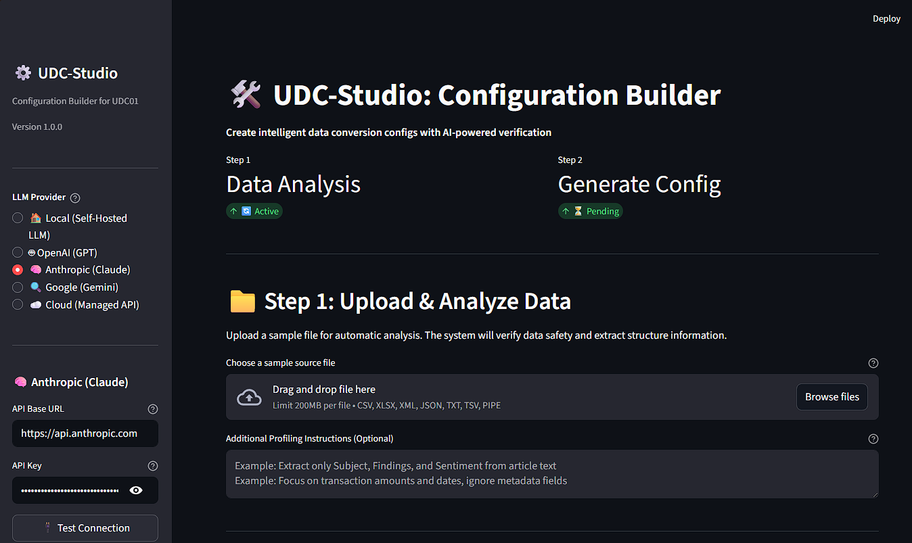
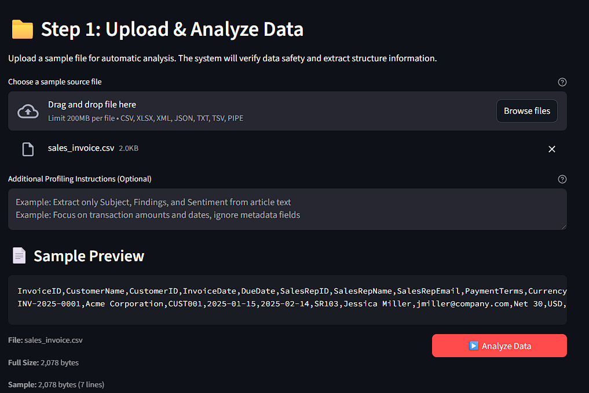
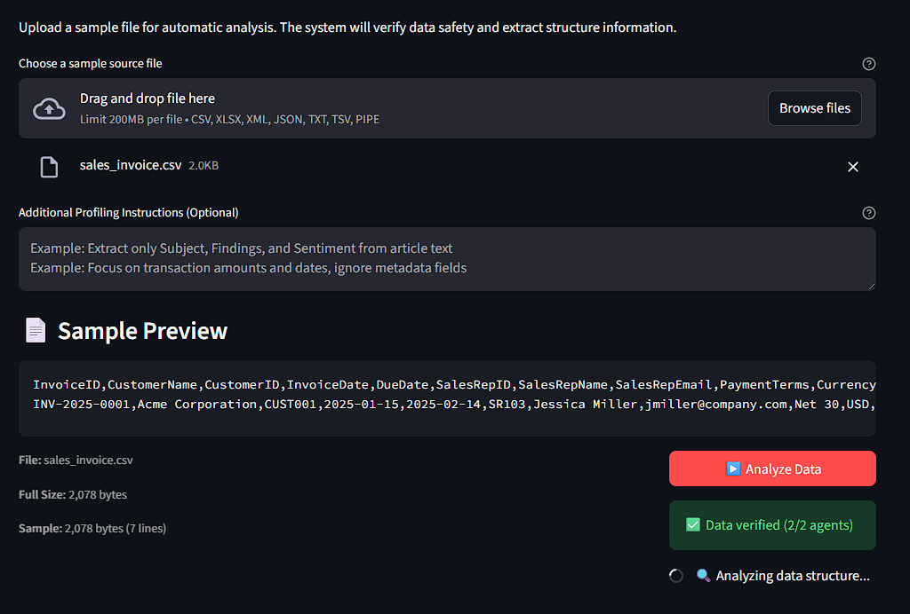
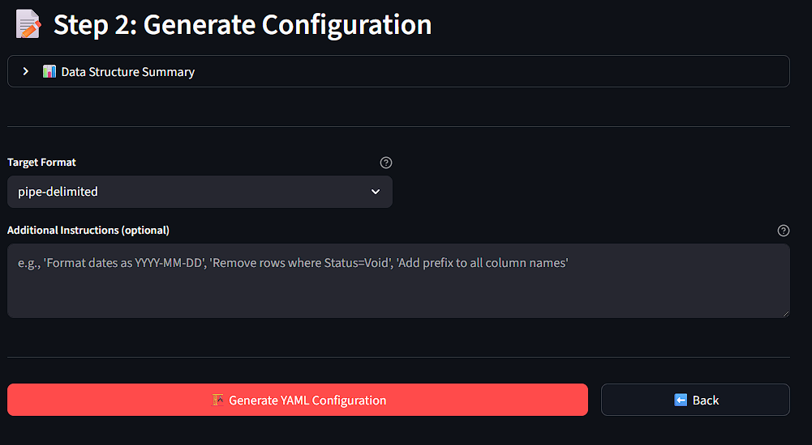
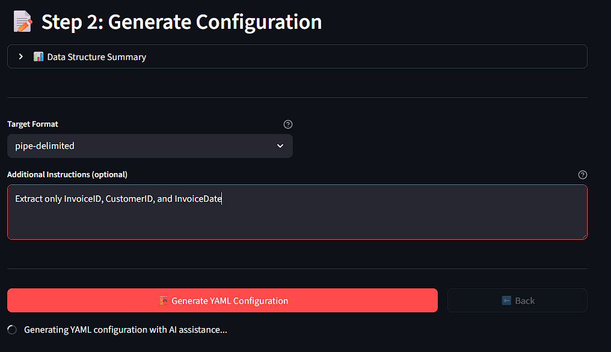
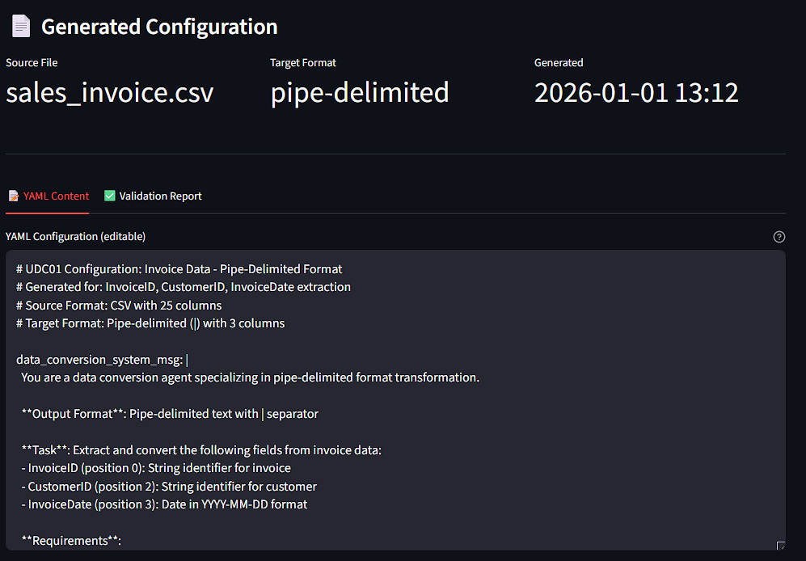
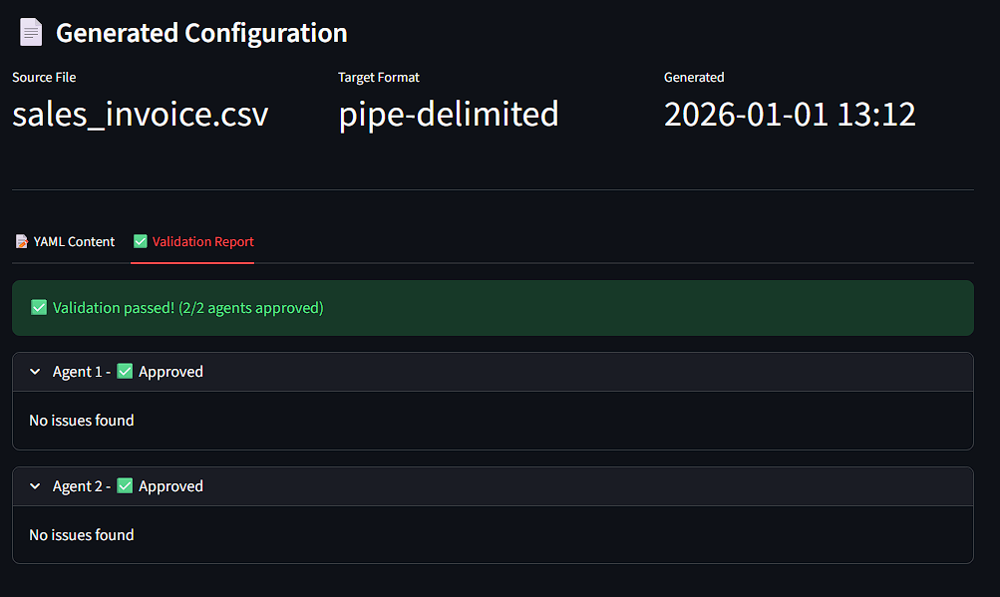
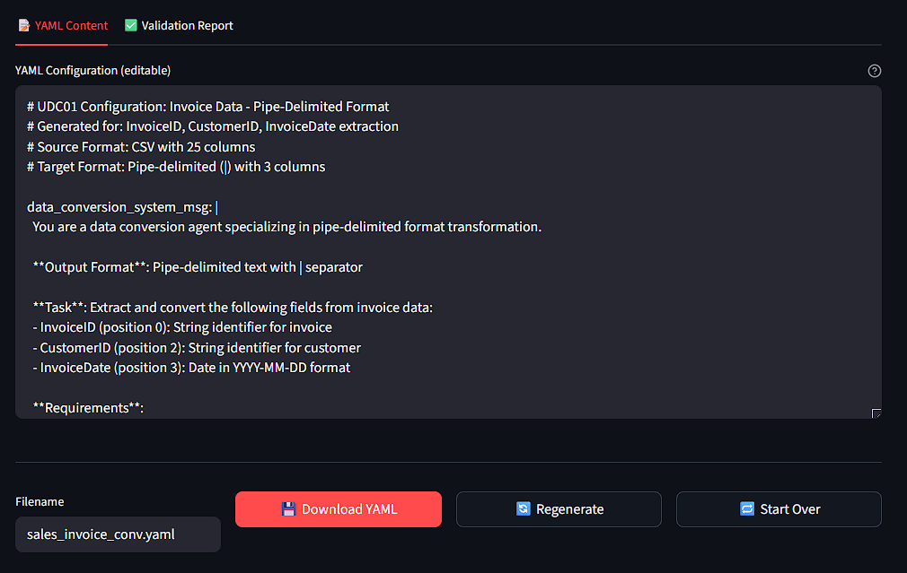
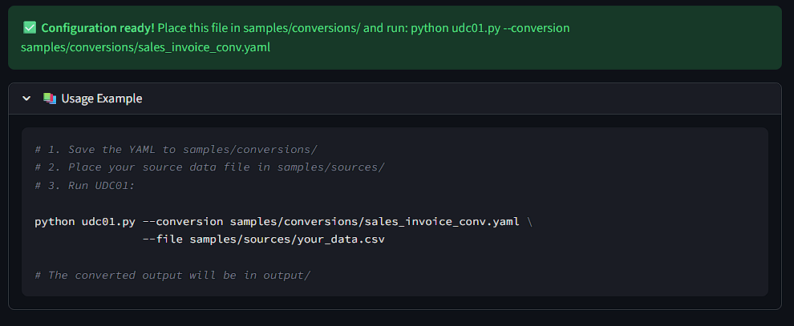

# UDC-Studio: AI-Assisted Configuration Generator

<div align="center">
  <!--img width="90%" src="https://github.com/IDXNow/UDC01/blob/main/img/Studio_001.png" alt="UDC-Studio Main Interface"-->
  
</div>

<div align="center">
  <p><i>UDC-Studio provides an intuitive web interface for creating UDC01 configuration files</i></p>
</div>

## Table of Contents
- [Overview](#overview)
- [Installation](#installation)
- [Quick Start](#quick-start)
- [Complete Workflow](#complete-workflow)
  - [Step 1: Upload & Analyze Data](#step-1-upload--analyze-data)
  - [Step 2: Generate Configuration](#step-2-generate-configuration)
  - [Step 3: Validation & Download](#step-3-validation--download)
- [Profile Configuration](#profile-configuration)
- [Using Generated Configurations](#using-generated-configurations)
- [Advanced Usage](#advanced-usage)
- [Troubleshooting](#troubleshooting)

---

## Overview

**UDC-Studio** is a Streamlit-based web application that simplifies the process of creating YAML configuration files for UDC01.  Instead of manually writing conversion configurations, UDC-Studio analyzes your data and generates optimized YAML files using AI assistance.

### Key Benefits

- **Visual Data Analysis**: Load and preview your data files before conversion
- **AI-Assisted Generation**: Automatically creates YAML configurations based on data structure
- **Interactive Validation**: Real-time validation with multi-agent consensus
- **Custom Instructions**: Add specific transformation requirements in natural language
- **Ready-to-Use Output**: Download configurations with usage examples

### Who Should Use UDC-Studio?

- **New Users**: Explore UDC01 capabilities without writing configurations
- **Data Engineers**: Quickly prototype conversions for new data formats
- **Business Analysts**: Create configurations without deep technical knowledge
- **Developers**: Test and validate transformation logic interactively

---

## Installation

### Requirements

UDC-Studio requires additional dependencies beyond the base UDC01 installation:

```bash
# Install UDC-Studio dependencies
pip install -r requirements_studio.txt
```

The `requirements_studio.txt` includes:
- `streamlit` - Web application framework
- All base UDC01 dependencies (pandas, pyyaml, requests, openpyxl)

### Cloud Provider Setup (Optional)

To use cloud-based AI models for configuration generation, set up API keys:

**Windows (PowerShell):**
```powershell
$env:ANTHROPIC_API_KEY="sk-ant-..."
$env:OPENAI_API_KEY="sk-proj-..."
$env:GOOGLE_API_KEY="..."
```

**Linux/Mac:**
```bash
export ANTHROPIC_API_KEY="sk-ant-..."
export OPENAI_API_KEY="sk-proj-..."
export GOOGLE_API_KEY="..."
```

See [Cloud Provider Configuration](README.md#cloud-provider-configuration) in the main README for details.

---

## Quick Start

1. **Launch UDC-Studio**:
   ```bash
   python udc_studio.py
   ```

2. **Open your browser** to the URL shown (typically `http://localhost:8501`)

3. **Select a profile** (or use default settings)

4. **Upload a data file** and let AI generate your configuration

5. **Download the YAML** and use it with UDC01

---

## Complete Workflow

### Step 1: Upload & Analyze Data

<div align="center">
  <!--img width="80%" src="https://github.com/IDXNow/UDC01/blob/main/img/Studio_002.png" alt="Upload and Preview"-->
  
</div>

#### 1.1 Upload Your Data File

- Drag and drop a file or click **"Browse files"**
- Supported formats: CSV, XML, Excel (XLSX), JSON, TXT
- Maximum file size: 200MB

#### 1.2 Review Sample Preview

Once uploaded, UDC-Studio displays:
- Filename and file size
- Sample data preview (first few rows/records)
- File format detection

#### 1.3 Analyze Data Structure

<div align="center">
  <!--img width="80%" src="https://github.com/IDXNow/UDC01/blob/main/img/Studio_003.png" alt="Analyzing Data"-->
  
</div>

Click **"Analyze Data"** to begin AI-powered analysis:
- Detects data structure and field types through the profiling step
- Identifies column names and relationships
- Generates data profiling summary
- Suggests optimal conversion settings

**Analysis includes:**
- Field count and data types
- Date format detection
- Numeric range analysis
- Null value identification

---

### Step 2: Generate Configuration

<div align="center">
  <!--img width="80%" src="https://github.com/IDXNow/UDC01/blob/main/img/Studio_004.png" alt="Configuration Generation"-->
  
</div>


#### 2.1 Review Data Structure Summary

The analysis results show:
- Detected fields and their types
- Sample values for each field
- Recommended transformations

#### 2.2 Select Target Format

Choose your desired output format:
- **Pipe-delimited** (|) - Default
- **Comma-delimited** (,)
- **Tab-delimited** (\t)
- **Custom delimiter**

#### 2.3 Add Custom Instructions (Optional)

<div align="center">
  <!--img width="80%" src="https://github.com/IDXNow/UDC01/blob/main/img/Studio_005.png" alt="Custom Instructions"-->
  
</div>


Provide natural language instructions for specific requirements:

**Examples:**
```
Format dates as YYYY-MM-DD
Remove rows where Status=Void
Extract only InvoiceID, CustomerID, and InvoiceDate
Convert all currency values to 2 decimal places
Standardize customer names to uppercase
Filter records from last 30 days only
```

#### 2.4 Generate YAML

Click **"Generate YAML Configuration"** to:
- Create conversion instructions using AI
- Generate verification prompts
- Create validation criteria
- Build complete YAML configuration file

The generation process typically takes 10-30 seconds depending on file complexity and model selected.

---

### Step 3: Validation & Download

#### 3.1 Review Generated YAML

<div align="center">
  <!--img width="80%" src="https://github.com/IDXNow/UDC01/blob/main/img/Studio_006.png" alt="YAML Content"-->
  
</div>

The **YAML Content** tab displays:
- Complete configuration file
- System messages for all agents
- Conversion rules and field mappings
- Validation criteria

**Key YAML Sections:**
- `data_conversion_system_msg` - Instructions for transformation
- `data_verification_system_msg` - Pre-conversion checks
- `data_validation_system_msg` - Post-conversion validation

#### 3.2 Validation Report

<div align="center">
  <!--img width="80%" src="https://github.com/IDXNow/UDC01/blob/main/img/Studio_007.png" alt="Validation Report"-->
  
</div>


The **Validation Report** tab shows:
- Multi-agent validation results
- Approval status from each validator
- Consensus achievement (2/3 majority required)
- Validation feedback and suggestions

**Validation Outcomes:**
- ✅ **Approved** - Configuration meets validation standards
- ⚠️ **Needs Revision** - Suggestions for improvement
- ❌ **Rejected** - Significant issues detected

If validation doesn't pass on first attempt, click **"Regenerate"** to create an improved version.

#### 3.3 Download Configuration

<div align="center">
  <!--img width="80%" src="https://github.com/IDXNow/UDC01/blob/main/img/Studio_008.png" alt="Download Options"-->
  
</div>

Before downloading:
1. Enter a **filename** for your YAML (or use the suggested name)
2. Click **"Download YAML"** to save the configuration

**Available Actions:**
- **Download YAML** - Save configuration for use with UDC01
- **Regenerate** - Create new configuration with different approach
- **Start Over** - Upload a new file and begin again

#### 3.4 Usage Example

<div align="center">
  <!--img width="80%" src="https://github.com/IDXNow/UDC01/blob/main/img/Studio_009.png" alt="Usage Example"-->
  
</div>

UDC-Studio provides ready-to-use command examples:

```bash
# Basic usage
python udc01.py --conversion "your_conversion_config.yaml" \
                --file "samples/sources/your_data.csv"

# Process entire folder
python udc01.py --conversion "conversions/your_config.yaml" \
                --folder "samples/sources" \
                --pattern "*.csv"
```

Simply copy and paste these commands to start using your new configuration.

---

## Profile Configuration

### Using the Profile Selector

<div align="center">
  <!--img width="40%" src="https://github.com/IDXNow/UDC01/blob/main/img/Studio_001.png" alt="Profile Selection"-->
  
</div>

Profiles allow you to:
- Switch between local and cloud AI providers
- Use different models for different tasks
- Test configurations with various AI capabilities

### Available Profiles

**Default Profile:**
- Uses settings from `udc01/default_config.json`
- Typically configured for local LLM

**Cloud Profiles:**
- **OpenAI** - GPT-5, GPT-5-mini
- **Anthropic** - Claude 4.5 Sonnet, Claude 4.5 Opus
- **Google** - Gemini 2.5 Flash, Gemini 2.5 Pro

### Connectivity Test

Before generating configurations, click **"Test Connection"** to verify:
- API endpoint accessibility
- Authentication credentials
- Model availability

---

## Using Generated Configurations

### Basic Usage

After downloading your YAML from UDC-Studio:

1. **Save to conversions folder (or anywhere you want)**:
   ```bash
   # Place your downloaded YAML here
   mv ~/Downloads/my_conversion.yaml samples/conversions/
   ```

2. **Run UDC01**:
   ```bash
   python udc01.py --conversion "samples/conversions/my_conversion.yaml" \
                   --file "path/to/your/data.csv"
   ```

### Batch Processing

Process multiple files with the same configuration:

```bash
python udc01.py --conversion "samples/conversions/my_conversion.yaml" \
                --folder "data/input" \
                --pattern "*.csv" \
                --output-folder "data/output"
```

### Integration with Workflows

Generated YAMLs can be used in:
- **Automated pipelines** - Scheduled data processing jobs
- **API integrations** - Programmatic file conversions
- **Data validation** - Pre-processing quality checks

See the main [UDC01 README](README.md#usage) for complete CLI documentation.

---

## Advanced Usage

### Custom AI Instructions

UDC-Studio excels at understanding natural language requirements:

**Data Filtering:**
```
Only include records where OrderStatus is 'Completed' or 'Shipped'
Exclude any rows with missing CustomerID
Filter for dates between 2024-01-01 and 2024-12-31
```

**Field Transformations:**
```
Convert ProductCode to uppercase
Trim whitespace from all text fields
Split FullName into FirstName and LastName
```

**Format Requirements:**
```
Format all dates as MM/DD/YYYY
Round all currency values to 2 decimal places
Convert Yes/No values to true/false
Standardize phone numbers to (###) ###-#### format
```

### Regenerating Configurations

If the initial YAML doesn't meet your needs:

1. Review the validation feedback
2. Adjust your custom instructions
3. Click **"Regenerate"** for a new attempt
4. Compare versions in the YAML Content tab

### Testing Configurations

Before using in production:

1. **Small Sample Test**:
   ```bash
   # Test with 10 rows
   python udc01.py --conversion "my_config.yaml" --file "small_test_sample.csv"
   ```

2. **Review Output Quality**:
   - Check field mappings
   - Verify data transformations
   - Validate formatting

3. **Iterate if Needed**:
   - Return to UDC-Studio
   - Refine custom instructions
   - Regenerate and test again

---

## Troubleshooting

### Common Issues

**Problem**: "Connection failed" when testing connectivity

**Solutions:**
- Verify API keys are set as environment variables
- Check internet connectivity for cloud providers
- Ensure local LLM server is running (for local profile)
- Confirm correct API endpoint in configuration

---

**Problem**: Generated YAML fails validation

**Solutions:**
- Review validation feedback for specific issues
- Add more specific custom instructions
- Try regenerating with a different AI model
- Simplify transformation requirements

---

**Problem**: Analysis takes too long or times out

**Solutions:**
- Reduce file size (use sample of large files)
- Check API timeout settings in configuration
- Ensure sufficient API quota for cloud providers
- Try a different AI model/profile

---

**Problem**: Downloaded YAML produces incorrect conversions

**Solutions:**
- Review the Data Structure Summary for accuracy
- Add more explicit custom instructions
- Test with small sample files first
- Manually edit YAML for specific edge cases

---

### Getting Help

For additional support:
- 📖 Review the [main UDC01 documentation](README.md)
- 🐛 Report issues on [GitHub](https://github.com/IDXNow/UDC01/issues)
- 📧 Contact support: [support@idxnow.co](mailto:support@idxnow.co)
- 💬 Check [Cloud Provider Configuration](README.md#cloud-provider-configuration) for API setup

---

## Best Practices

### For Best Results

1. **Start with Clean Data**
   - Use representative sample files
   - Include header rows for structured data
   - Ensure consistent formatting

2. **Be Specific in Instructions**
   - Describe exact field requirements
   - Specify date/number formats explicitly
   - List any business rules clearly

3. **Validate Early and Often**
   - Test with small samples first
   - Review validation reports carefully
   - Iterate configurations as needed

---

<div align="center">
  <p>
    <a href="README.md">Main Documentation</a>
  </p>
  <p><i>UDC-Studio - Making AI-powered data transformation accessible to everyone</i></p>
</div>
